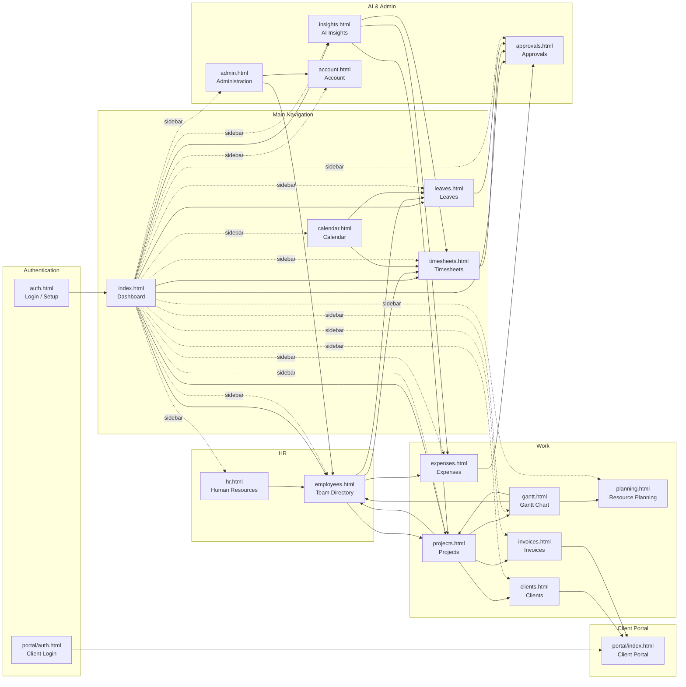

# GammaHR v2 — App Architecture Summary

**For:** Product Owner
**Date:** April 12, 2026
**Status:** Prototype — 20 pages, production-ready interactive prototype

---

## Section 1 — What This App Does

GammaHR v2 is a **workforce management platform** for professional services companies (agencies, consultancies, tech firms) that need to track employee time, capacity, and project profitability in one place. It replaces spreadsheets and disconnected tools with a single, role-aware system that serves employees, project managers, and administrators differently.

### Page Descriptions

| # | Page | File | Purpose (max 2 sentences) |
|---|------|------|--------------------------|
| 1 | **Dashboard** | `index.html` | The personal command center shown on login — displays the employee's week-at-a-glance timesheet status, 4 KPI cards, action-required items, team presence, and a revenue snapshot. Everything requiring action (pending approvals, missing timesheets, expiring contracts) surfaces here first. |
| 2 | **Authentication** | `auth.html` | Handles login (email/password, passkey, SSO), multi-factor authentication, and the first-time setup wizard for new companies. Also provides the employee onboarding flow (set password → complete profile → quick tour). |
| 3 | **Team Directory** | `employees.html` | Browseable directory of all employees with three view modes: grid (photo cards), list (compact table), and org chart (hierarchical tree). Clicking any employee opens a full profile with tabs for Timeline, Projects, Leaves, Timesheets, Expenses, Skills, and Documents. |
| 4 | **Timesheets** | `timesheets.html` | Weekly time-entry interface where employees log billable and internal hours per project. Managers see a team approval queue showing real work-time percentages including overwork indicators (amber when total exceeds 100%). |
| 5 | **Leaves** | `leaves.html` | Leave request and approval hub showing each employee's annual/sick/personal/WFH balance as progress bars. Employees submit requests; managers approve with automatic conflict detection against the team calendar. |
| 6 | **Expenses** | `expenses.html` | Expense submission and approval flow with category breakdown, receipt upload, and OCR via Claude AI. Shows a summary of pending, approved, and billable expenses with monthly analytics. |
| 7 | **Projects** | `projects.html` | List of all active projects (7 in prototype) with client assignments, team compositions, budgets, and timelines. Clicking a project opens a full detail view with assigned team members, status, and financial breakdown. |
| 8 | **Clients** | `clients.html` | Client relationship hub for the 4 canonical clients (Acme Corp, Globex Corp, Initech, Umbrella Corp). Each client record shows active projects, total revenue, assigned team, contact details, and associated invoices. |
| 9 | **Invoices** | `invoices.html` | Invoice lifecycle management — create, send, track, and mark invoices as paid. Invoice numbers use the format INV-2026-XXX; portal outstanding: €17,400. |
| 10 | **Calendar** | `calendar.html` | Company-wide calendar in day/week/month/quarter/year views showing leaves, public holidays, project deadlines, and meetings. Color-coded by event type; supports event creation and editing. |
| 11 | **Gantt Chart** | `gantt.html` | Unified resource Gantt — one sticky employee-name column on the left, one horizontally-scrollable chart area on the right, scrolling together as a single vertical unit. Supports zoom levels (1W, 2W, 1M, 3M, 6M, 1Y) and filter quick-chips (Bench, On Leave, Over-allocated, etc.). |
| 12 | **Resource Planning** | `planning.html` | Forward-looking capacity planner showing allocation by week with scenario ("what-if") simulation. Forecasts team availability and work time trends for the next 12 weeks. |
| 13 | **Approvals** | `approvals.html` | Unified inbox for all pending approvals — timesheets, leave requests, and expenses in compact scannable rows. Supports bulk approve/reject, AI recommendation banner, and filter by type/status. |
| 14 | **AI Insights** | `insights.html` | AI-generated analytics: revenue trends, project profitability, work time patterns, and proactive alerts (overwork, bench, contract expiry). Charts are filterable and reports are downloadable. |
| 15 | **Human Resources** | `hr.html` | Covers the full employee lifecycle — recruitment (job postings + kanban candidate pipeline), onboarding checklists, offboarding tasks, and employee records (contracts, certifications, documents). |
| 16 | **Administration** | `admin.html` | System configuration for Admins — 12-user directory, 6-department structure, work-hour settings, company profile. The resource management table shows each employee's billable/internal/total work-time bars in one scannable view. |
| 17 | **Account & Settings** | `account.html` | Personal settings page: profile info (name, email, phone), notification preferences, theme, security (password, passkey, 2FA), and billing/subscription management. |
| 18 | **Client Portal** | `portal/index.html` | Simplified client-facing view showing outstanding invoices (€17,400 across INV-2026-048 and INV-2026-043), active project status, and a payment interface. Clients never see internal team data. |
| 19 | **Portal Auth** | `portal/auth.html` | Separate login page for client portal users — email and password only, no passkey or SSO. Sessions are scoped to the client's data only. |
| 20 | **Auth (shared)** | `auth.html` | *(See row 2)* |

---

## Section 2 — Page Linking Map (Mermaid)

**Hub pages** (many inbound + outbound links): `dashboard`, `approvals`, `employees`, `projects`
**Leaf pages** (mostly terminal views): `portal/auth.html`, `auth.html`, `account.html`, `calendar.html`

---

## Section 3 — Cross-Page Data Relationships

| Page | Data It Shows | Where That Data Also Appears | Risk of Inconsistency |
|------|--------------|-----------------------------|-----------------------|
| **admin.html** | 12 users, 6 departments, employee names, roles, work-time bars | employees.html (directory), timesheets.html (approval queue), gantt.html (rows), index.html (team presence) | **HIGH** — employee roles and department counts must match exactly across all pages |
| **timesheets.html** | Billable/internal hours per employee per week (8 named employees) | approvals.html (pending timesheets), insights.html (work time charts), admin.html (resource table), index.html (dashboard KPIs) | **HIGH** — billable % and overwork indicators must use canonical formula everywhere |
| **approvals.html** | Pending timesheets, leaves, expenses with employee names and amounts | timesheets.html (source), leaves.html (source), expenses.html (source), index.html (pending count KPI) | **HIGH** — approval counts in sidebar badge and dashboard KPI must stay in sync |
| **employees.html** | All 8 named + 4 unnamed employees, roles, departments, presence | admin.html, gantt.html, timesheets.html, leaves.html, expenses.html, projects.html, calendar.html, hr.html | **HIGH** — Alice Wang = "On Leave" (NOT "Away"); Bob Taylor = "Backend Developer" (NOT "Senior Developer"); Emma Laurent = Active |
| **gantt.html** | Employee rows × time axis, project bars, leave bars, bench markers | planning.html (forward view), projects.html (team members), employees.html (profile timeline) | **MEDIUM** — Bob Taylor must show bench (grey/dashed) bar, Alice Wang must show leave Apr 14–18 |
| **projects.html** | 7 active projects with client assignments and teams | clients.html (client → projects), invoices.html (project → invoices), gantt.html (project bars), insights.html (profitability) | **MEDIUM** — client names must be canonical (Globex Corp NOT "Globex Corporation") |
| **clients.html** | Acme Corp, Globex Corp, Initech, Umbrella Corp | invoices.html (client per invoice), portal/index.html (client sees their own invoices), projects.html | **MEDIUM** — 4 clients exactly; "Globex Corp" not "Globex Corporation" |
| **invoices.html** | INV-2026-041 (Acme), portal outstanding €17,400 (INV-2026-048 €12,400 + INV-2026-043 €5,000) | portal/index.html (outstanding invoices), clients.html (per-client revenue) | **HIGH** — invoice numbers use 3-digit suffix; portal amounts must match exactly |
| **index.html** (dashboard) | 12 active employees, 394h/week, 7 open projects, 82% team work time | admin.html (same KPIs in admin view), insights.html (trend charts) | **HIGH** — KPI numbers must be identical across dashboard and admin |
| **leaves.html** | Alice Wang on leave Apr 14–18; leave balances per employee | calendar.html (leave events), employees.html (employee leave tab), approvals.html (pending leave requests), gantt.html (leave bars) | **HIGH** — Alice Wang leave dates must be Apr 14–18 (NOT Apr 1–11 or Apr 7–11) |
| **expenses.html** | Bob Taylor hotel expense €340 (Marriott Lyon) | approvals.html (pending expense), employees.html (employee expense tab) | **LOW** — single canonical expense entry |
| **portal/index.html** | Outstanding invoices €17,400 (INV-2026-048 + INV-2026-043) | invoices.html (same invoices from internal view) | **HIGH** — amounts must match between internal and portal views |
| **hr.html** | Emma Laurent = HR Specialist, Active status | employees.html, admin.html (user table) | **MEDIUM** — Emma Laurent must show Active (not Inactive) in all pages |
| **planning.html** | Team capacity grid with work time %, overwork flags for John Smith (112.5%) and Marco Rossi (107.5%) | gantt.html, admin.html (resource table), insights.html | **MEDIUM** — overwork must be visually flagged (amber) for John and Marco |

**Named employees and canonical data:**

| Employee | Role | Dept | Billable | Internal | Total Work Time | Presence | Notes |
|----------|------|------|---------|---------|----------------|---------|-------|
| Sarah Chen | Project Manager | Engineering | 34h (85%) | 6h (15%) | 100% | Online | — |
| John Smith | Senior Developer | Engineering | 40h (100%) | 5h (12.5%) | **112.5%** | Online | **OVERWORK** — amber |
| Marco Rossi | Operations Lead | Operations | 36h (90%) | 7h (17.5%) | **107.5%** | Away | **OVERWORK** — amber |
| Carol Williams | Design Lead | Design | 38h (95%) | 2h (5%) | 100% | Online | — |
| Alice Wang | On Leave | Engineering | 16h (40%) | 2h (5%) | 45% | On Leave | Leave: Apr 14–18 |
| David Park | Finance Lead | Finance | 28h (70%) | 6h (15%) | 85% | Offline | — |
| Emma Laurent | HR Specialist | HR | 18h (45%) | 18h (45%) | 90% | Online | Status: Active |
| Bob Taylor | Backend Developer | Engineering | 0h (0%) | 0h (0%) | 0% | Offline | Bench — zero project work |

---

## Section 4 — Missing or Broken Links

The following navigation paths exist in `specs/APP_BLUEPRINT.md` but are currently broken or absent in the HTML prototype:

| Issue | Expected Path | Current State | Risk |
|-------|--------------|---------------|------|
| **Project detail drill-down** | Click project name in any list → full project detail view | `projects.html` may lack a working detail panel for all 7 projects | HIGH — product owner reported as UI10 |
| **Employee profile mini-card hover** | Hover any employee name anywhere → mini hover card shows role, dept, status | Not universally applied (missing on some table cells) | HIGH — spec §1.1 requires universal clickable identity |
| **Client Portal link from invoices** | `invoices.html` → "View in Portal" link for each invoice | Link to `portal/index.html` may not filter to specific client | MEDIUM |
| **Department filtered view** | Click department name (in admin or employee list) → filtered employee list | No department-scoped routing exists in prototype | MEDIUM |
| **Timesheet day click** | Dashboard "Week at a Glance" → click any day → open timesheet entry for that day | Cross-page link from `index.html` to `timesheets.html` with date pre-filled | MEDIUM |
| **Leave calendar overlay** | `leaves.html` calendar view should show all team leaves, not just personal | Team leave overlay may be incomplete | MEDIUM |
| **Invoice → Client drill-down** | Click client name in `invoices.html` → client detail | May navigate generically, not to specific client record | LOW |
| **Approval → source document** | Click approval item in `approvals.html` → opens original timesheet/expense/leave | Modal or drawer link may be missing for some approval types | HIGH |
| **Gantt → Employee profile** | Click employee name in Gantt left column → employee profile | Links exist but may navigate to generic employee page | MEDIUM |
| **Sidebar "Approvals" badge** | Live count badge on sidebar Approvals link should update when items approved | Badge is static in prototype (not live-updating via JS) | LOW |
| **Calendar → Timesheet entry** | Click a day in `calendar.html` → opens timesheet for that day | No cross-page navigation implemented | LOW |
| **Help & Shortcuts** | Sidebar footer "Help & Shortcuts" link | May not link to any page or open a keyboard shortcuts modal | LOW |
| **palm-tree icon (mobile nav)** | Mobile bottom-nav Leaves link uses `palm-tree` Lucide icon | `palm-tree` may not exist in the current Lucide version; sidebar uses `umbrella` correctly | MEDIUM — UI19 |
